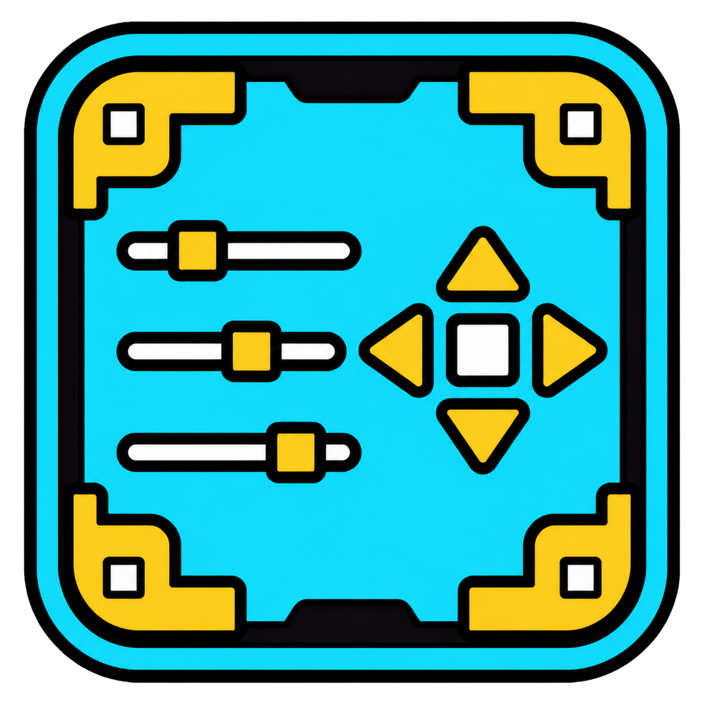

<p align="center">
  
</p>

<h1 align="center">Pause Menu Studio</h1>

<p align="center">
  <strong>A complete Geometry Dash pause-menu editor built directly into the game.</strong><br>
  Move, resize, group, and hide controls, save named layouts,<br>
  and add configurable cards for the level, music, coins, and difficulty.
</p>

<p align="center">
  <a href="https://github.com/BANANCHIKIREAL/pause-menu-studio/releases/latest"></a>
  
  
  
  
</p>

<p align="center">
  <a href="#-features">Features</a> •
  <a href="#-quick-start">Quick start</a> •
  <a href="#%EF%B8%8F-controls">Controls</a> •
  <a href="#-compatibility">Compatibility</a> •
  <a href="#-known-limitations">Known limitations</a> •
  <a href="#%EF%B8%8F-building-from-source">Building</a>
</p>

> [!WARNING]
> **Pause Menu Studio is experimental.** It is usable, but the pause menu is also modified by many other mods and texture packs. Some combinations may cause visual glitches, moved controls, or saved node paths that no longer match. Save a named layout before updating mods or making a large redesign.

## ✨ Features

### 🎨 Visual editor

- Move almost any reachable pause-menu element with a mouse or touchscreen.
- Use one compact bottom toolbar instead of separate controls scattered around the screen.
- Use the contextual panel beside the selection for the MOVE lock, exact scaling, local reset, and Hide.
- A click only selects an element. Enable **MOVE**, then drag or use the arrow keys; press MOVE again to lock it.
- Repeated clicks at the same cursor position cycle through overlapping blocks from front to back.
- Resize selected buttons and logical blocks with a touch-friendly slider.
- Use arrow keys for precise movement.
- Use `Ctrl` for multi-selection with a shared orange outline.
- Move multiple selected blocks together.
- Optional 5-unit grid snapping without a bright overlay.
- Move the **EDIT / DONE** button itself.
- Enter **Preview Mode** to inspect a clean, read-only pause menu without editor chrome.
- Keep the selected block clear while the surrounding pause menu is softly dimmed.

### ↩️ History and reset

- Undo with `Ctrl + Z` or the **UNDO** button.
- Redo with `Ctrl + Y` or the **REDO** button.
- Reset the selected block with `R`.
- Reset only the selected block's scale.
- Use a full **RESET** with a confirmation prompt.
- The editor warns before leaving a level with unsaved Edit Mode changes.

### 💾 Named layouts

- Save multiple pause-menu designs under custom names.
- Select and apply a saved design through **LAYOUTS**.
- Store positions, scale, hidden state, and information-card presence together.
- Recreate cards stored in a layout even when their normal settings are disabled.
- Keep active-layout cards available after reopening the pause menu.
- Preserve temporarily unavailable dynamic blocks instead of deleting their records.
- A full Reset removes layout-only cards and restores the normal card settings.
- Browse visual layout cards with miniature position previews and saved dates.
- Rename or duplicate a layout without overwriting its original snapshot.

### 🗑️ Hidden Blocks

- `Delete` sends the selected block to a persistent recycle bin. `Backspace` is not bound to removal.
- The recycle bin stores the block's position and scale before hiding it.
- Restore a hidden block through the **Hidden Blocks** window.
- Browse hidden controls in a two-column icon grid with large Restore buttons.
- Before opening the list, v2.0.7+ audits the active layout and invisible controls previously managed by Pause Menu Studio.
- If a missing record can be linked reliably to a saved layout or managed node, it is returned to the list automatically.

### 🧩 Logical groups

Some visual controls are made from several technical nodes. Pause Menu Studio attempts to treat them as one logical block:

- the Jukebox/NONGD music panel, disc, title, artist, **MORE**, and delete controls;
- the Better Volume **Music** section;
- the Better Volume **SFX** section;
- the level-title card;
- the difficulty card, rating flame, and star reward;
- the user-coin card.

This lets you move a complete widget instead of accidentally selecting a `%` label, an internal sprite, or one piece of a frame.

## 🚀 Quick start

1. Install [Geode](https://geode-sdk.org/) for Geometry Dash.
2. Download the `.geode` file from [Releases](https://github.com/BANANCHIKIREAL/pause-menu-studio/releases/latest).
3. Install the package for your platform:
   - **Windows:** place it in `Geometry Dash/geode/mods`.
   - **Android:** place it in `/storage/emulated/0/Android/media/com.geode.launcher/game/geode/mods/`, or import it through Geode's mod installer.
4. Make sure the required **NONGD/Jukebox** dependency (`fleym.nongd >= 3.6.2`) is installed.
5. Fully restart Geometry Dash.
6. Open any level and pause the game.
7. Press **EDIT**, select an element, enable **MOVE**, and drag it.
8. Press **DONE** to apply the current editing session.
9. Press **SAVE** if you want to store a named layout.

> [!TIP]
> If one block is hidden behind another, click the same point repeatedly without moving the cursor. Selection cycles through the logical blocks under that point.

## ⌨️ Controls

| Action | Key / button | Notes |
|---|---|---|
| Enter Edit Mode | **EDIT** | The button itself can also be moved |
| Leave Edit Mode | **DONE** | Applies the current editing session |
| Select a block | Click / tap | A single press does not move it |
| Unlock / lock movement | Context **MOVE** button | Each block remembers its own on/off state while the editor is open |
| Drag a block | Enable MOVE, then click / touch + movement | Dragging starts after a small movement threshold |
| Select the next overlapping block | Repeated click / tap at the same point | No object movement is required |
| Add a block to selection | `Ctrl + click` | Requires a keyboard; multi-selection uses an orange outline |
| Precise movement | `←` `↑` `↓` `→` | Optional physical-keyboard shortcut; moves by 1 game unit |
| Faster movement | `Shift + arrow` | Optional physical-keyboard shortcut; moves by 5 game units |
| Undo | `Ctrl + Z` / **UNDO** | Android users can use the visible button |
| Redo | `Ctrl + Y` / **REDO** | Android users can use the visible button |
| Reset selected block | `R` | Restores its original position and size |
| Hide selected block | `Delete` | Sends it to Hidden Blocks; Backspace does nothing |
| Resize | Context scale slider or numeric field | Touch-friendly range from `0.15×` to `3.5×` |
| Reset size | Context reset button | Does not delete or hide the block |
| Save a layout | **SAVE** | Uses a custom name |
| Select a layout | **LAYOUTS** | Applies positions, scale, cards, and Hidden Blocks |
| Open recycle bin | Trash button | Lists and restores hidden blocks |
| Full reset | **RESET** with no selection | Always asks for confirmation |
| Preview the menu | Preview toolbar button | Hides editor UI for a clean, read-only view |
| Return from Preview | **RETURN** | Restores the current Edit Mode session |
| Rename / duplicate layout | **REN / COPY** | Available on each Saved Layout card |

## 🖼️ Menu styles

Three base styles are available:

| Style | Intended use |
|---|---|
| **Classic** | Standard and recommended; selected by default |
| **Compact** | A denser arrangement |
| **Showcase** | Extra space for information cards |

Each style uses its own saved positions so coordinates from one style do not overwrite another.

## 🪪 Information cards

Cards can be enabled separately in the mod settings.

| Card | Content | Default |
|---|---|---|
| **Level name** | Level title and creator | Off |
| **Music** | The full song widget: title, artist, SongID, size, and available actions | Off |
| **Coins** | Native user-coin icons | Off |
| **Difficulty** | Geometry Dash or compatible difficulty face and native star icon | Off |
| **Demonlist position** | An available AREDL/Pemonlist rank for an eligible demon | On when data is available |

## ⚙️ Settings

| Setting | Purpose | Default |
|---|---|---|
| **Enable Pause Menu Studio** | Enables or disables the entire mod | `On` |
| **Menu style** | Selects Classic, Compact, or Showcase | `Classic` |
| **Level name** | Shows the level card | `Off` |
| **Music** | Shows the music card | `Off` |
| **Coins** | Shows the coin card | `Off` |
| **Difficulty** | Shows the difficulty card | `Off` |
| **Demonlist position** | Shows an available demonlist rank | `On` |
| **Edit mode on open** | Automatically enables the editor when the pause menu opens | `Off` |
| **Snap to grid** | Rounds the released position to a 5-unit grid | `Off` |

## 🤝 Compatibility

The minimum versions below come directly from [`mod.json`](mod.json).

| Mod | ID | Minimum version | Integration |
|---|---|---:|---|
| **NONGD / Jukebox** | `fleym.nongd` | `3.6.2` | Required dependency; uses the mod's real music widget |
| **Gold User Coins** | `colon.gold_user_coins` | `2.0.4` | Compatible colored/gold user coins |
| **Demons in Between** | `hiimjustin000.demons_in_between` | `1.7.0` | Additional difficulty faces |
| **GDDP Integration** | `minemaker0430.gddp_integration` | `1.1.16` | Additional demon progression visuals |
| **Integrated Demonlist** | `hiimjustin000.integrated_demonlist` | `1.7.13` | AREDL/Pemonlist placement for eligible demons |
| **GodlikeFaces** | `adyagd.godlikefaces` | `1.1.10` | Compatible rating flames and difficulty faces |
| **Better Volume** | `nwo5.better_volume` | `2.1.4` | Music and SFX are selected as two complete logical blocks |
| **Better Escape** | `ecuet.better-escape` | `1.0.1` | Alternative exit behavior and `Shift + Esc` compatibility |

> [!IMPORTANT]
> Integrations depend on the node hierarchy and internal IDs of other mods. If another mod changes when a control is created, its ID, or its parent hierarchy, Pause Menu Studio may stop recognizing that block until compatibility is updated.

### Texture packs

Pause Menu Studio attempts to move outer button containers without overwriting their animated internal sprites. However, a texture pack that moves or recreates the **entire button node** may compete with the editor for its position. Include the texture-pack name and a short video in a bug report when this happens.

## 🗃️ Layout and Hidden Blocks storage

- Position and scale are stored using a node path inside `PauseLayer`.
- Normal position keys include the selected menu style and applied-layout generation.
- A named layout stores position, scale, hidden state, and known information-card presence.
- Hidden Blocks also stores the block's restore position and scale.
- If a dynamic node is temporarily absent, its record remains stored instead of being deleted.
- Opening Hidden Blocks audits the active layout and invisible nodes previously managed by the editor.

This reduces lost controls, but it cannot guarantee a path match after another mod radically changes its UI hierarchy.

## ⚠️ Known limitations

Pause Menu Studio is intentionally marked **experimental**.

1. **Every mod combination cannot be covered.** Integrations are written for the IDs and minimum versions declared in `mod.json`, but I cannot confirm every possible combination. Newer versions may change their internal UI.
2. **Dynamic controls can be recreated.** Jukebox, Better Volume, and some texture packs rebuild UI after opening the pause menu or changing a song. Known controls are stabilized repeatedly, but a rare brief jump or a new incompatibility may still occur.
3. **Old layouts may contain unavailable paths.** This is expected when a layout was saved with a mod that is currently disabled. The record is kept and may become available when that mod returns.
4. **Technical invisible nodes are not recovered without evidence.** Automatic Hidden Blocks recovery only uses controls previously managed by Pause Menu Studio or marked hidden in the active layout. This avoids adding unrelated service nodes from other mods.
5. **Only the declared platforms are supported.** The current manifest targets Geometry Dash `2.2081` and Geode `5.8.2` on Windows, Android32, and Android64. iOS and macOS are not declared or built.
6. **Android runtime coverage is limited.** Android32 and Android64 packages compile successfully, but the current release has not been tested on every phone, Android version, launcher version, or touch configuration.
7. **Extreme scale and overlap remain the user's choice.** The editor helps select overlapping blocks but intentionally does not prohibit unusual designs.

## 🧯 Troubleshooting

### A block disappeared

1. Open **Hidden Blocks** so v2.0.7+ can run its missing-record audit.
2. Check whether the mod that owns the block is enabled.
3. Reopen the pause menu so dynamic mods can recreate their nodes.
4. Do not use a full Reset before saving logs and screenshots.

### A layout looks wrong

1. Check whether the same Classic, Compact, or Showcase style is selected.
2. Compare the enabled mod set with the setup used when the layout was saved.
3. Select the affected block and press `R` for a local reset.
4. Use a full **RESET** only after confirming the prompt.

### The game crashed

Create a [Bug report](https://github.com/BANANCHIKIREAL/pause-menu-studio/issues/new?template=bug-report.yml) and attach:

- the file from `Geometry Dash/geode/crashlogs`;
- `latest.log` from `Geometry Dash/geode/logs`;
- your Pause Menu Studio version;
- the full enabled-mod list;
- your texture-pack name;
- exact actions immediately before the crash;
- a screenshot or video for visual problems.

## 🐞 Reporting a bug

Before creating an issue:

1. Fully restart Geometry Dash and reproduce the problem again.
2. Check whether it follows the same action sequence.
3. If possible, disable other mods in groups to find the conflicting mod.
4. Keep the crashlog and `latest.log`.
5. Use the provided **Bug report** form so the required reproduction information is included.

[](https://github.com/BANANCHIKIREAL/pause-menu-studio/issues/new?template=bug-report.yml)

## 🛠️ Building from source

### Requirements

- Geometry Dash `2.2081`;
- [Geode SDK](https://docs.geode-sdk.org/getting-started/);
- CMake `3.21` or newer, as declared in [`CMakeLists.txt`](CMakeLists.txt);
- a `GEODE_SDK` environment variable pointing to the SDK directory.

For **Windows**, install Visual Studio 2022 Build Tools with the C++ toolchain. For **Android**, install a recent Android NDK supported by the current Geode SDK; this project was verified with NDK `30.0.15729638` and Clang `21.0.0`.

### Commands

Open **Developer PowerShell for VS 2022** in the project root:

```powershell
$env:GEODE_SDK = 'C:\path\to\GeodeSDK'
cmake -S . -B build-local -DCMAKE_BUILD_TYPE=Release
cmake --build build-local --config Release --parallel
```

The package is created at:

```text
build-local/bananchikireal.pause-menu-studio.geode
```

The project uses C++23 and `setup_geode_mod`.

For Android, use the Geode CLI from the project root:

```powershell
geode build -p android32 --ndk 'C:\path\to\Android\Sdk\ndk\30.0.15729638' --config Release
geode build -p android64 --ndk 'C:\path\to\Android\Sdk\ndk\30.0.15729638' --config Release
```

The packages are created in `build-android32` and `build-android64`. The repository's GitHub Actions workflow also builds Windows, Android32, and Android64 and combines the platform artifacts.

## 🧱 Project structure

```text
pause-menu-studio/
├── src/
│   ├── main.cpp                  # PauseLayer, editor, cards, and integrations
│   ├── HiddenBlocks.*            # Persistent recycle-bin storage
│   ├── HiddenBlocksPopup.*       # Hidden-block restoration UI
│   ├── LayoutProfiles.*          # Named-layout serialization
│   ├── LayoutProfilePopups.*     # SAVE and LAYOUTS popups
│   └── BlockIcons.*              # Native GD icon selection for previews and Trash
├── mod.json                      # Manifest, dependencies, and settings
├── CMakeLists.txt                # Build configuration
├── changelog.md                  # Version history
├── about.md                      # In-game Geode About page
└── logo.png                      # Mod icon
```

## 📜 Version history

The complete history is available in [`changelog.md`](changelog.md).

### v3.0.2

- Makes Delete the only removal key and keeps Backspace unbound.
- Remembers FREE MOVE separately for each block during the current editor session.
- Adds custom white Reset/View artwork and removes the orange 1.00 slider marker.
- Captures real object sprite frames for Trash, repairs old Trash previews, and separates REN/COPY.

### v3.0.1

- Makes MOVE a real lock/unlock toggle and adds exact numeric scale input.
- Adds a smooth Edit Mode exit, wider control spacing, rounded GD frames, and dedicated Reset/View icons.
- Saves the complete Trash state and icon types per named layout.
- Replaces dot-only previews with miniature Geometry Dash icons.

### v3.0.0

- Rebuilds Edit Mode with a unified bottom toolbar and contextual selection panel.
- Adds Preview Mode, animated feedback, focused selection shading, corner handles, and logical-block labels.
- Adds visual Saved Layout cards with previews, dates, Rename, Duplicate, Apply, and Delete.
- Adds a visual Hidden Blocks grid with native GD icons and larger Restore actions.
- Adds a touch-friendly scale slider and larger Android hit targets.

### v2.2.0

- Adds Android32 and Android64 support for Geometry Dash 2.2081.
- Uses the existing touch editor for tap-to-select and drag-to-move controls.
- Adds automated Windows and Android builds through GitHub Actions.

### v2.1.0

- Captures the original PlayLayer level name so a Jukebox NONG/cover title cannot replace an official level title after reopening the pause menu.
- Disables Coins and Difficulty cards by default.
- Stores card presence in named layouts and recreates layout cards even when their normal settings are disabled.
- Removes layout-only cards during a full Reset.
- Audits Hidden Blocks and preserves temporarily unavailable dynamic nodes.

## 🤍 Author

Developed by **BANANCHIKIREAL**<br>
GitHub: [@BANANCHIKIREAL](https://github.com/BANANCHIKIREAL)

If the mod is useful, consider starring the repository. It helps show that continued development is worthwhile.

---

<p align="center">
  <strong>Build a pause menu that looks exactly the way you want.</strong><br>
  <sub>And please report bugs—experimental software becomes stable through clear, reproducible reports.</sub>
</p>
